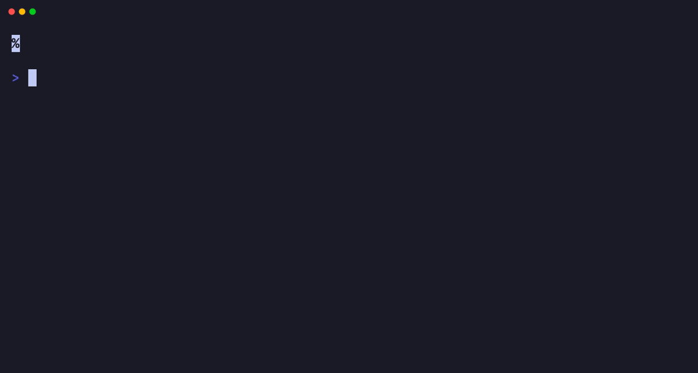

# Count Focus

Timer de foco para la terminal.

[English](README.md)



## Instalación

Con Homebrew:

```bash
brew tap gianni-labs/tap
brew trust --formula gianni-labs/tap/count-focus
brew install count-focus
```

Esto instala el comando `count-focus`.

## Uso

```bash
count-focus <duration>
```

Ejemplos:

```bash
count-focus 10s
count-focus 5m
count-focus 1h
count-focus 1h30m
count-focus 1h30m10s
```

### Título

Podés ponerle un título al timer para saber qué estás haciendo:

```bash
count-focus 25m --title "Escribir informe"
count-focus 1h -t "Deep work"
```

### Hasta una hora específica

En vez de una duración, podés apuntar a una hora del reloj en formato 24 horas. Count Focus cuenta regresivamente hasta esa hora de hoy:

```bash
count-focus --until 15:00      # hasta las 15:00
count-focus -u 15:30:30        # con segundos
```

Si la hora ya pasó hoy, muestra un error.

### Cronómetro (contar hacia arriba)

Con `--up` cuenta hacia arriba desde cero:

```bash
count-focus --up          # corre hasta que salgas
count-focus --up 30m      # con meta: al alcanzarla avisa y se pone verde
```

### Ejecutar un comando al terminar

Con `--exec` podés correr un comando de shell cuando el timer termina, o cuando alcanza una meta en modo `--up`:

```bash
count-focus 25m --exec "open -a Slack"
count-focus 10m --exec "say 'se acabó el tiempo'"    # voz en macOS
```

El comando se lanza sin bloquear la pantalla final. Sirve también para notificaciones nativas, por ejemplo en macOS:

```bash
count-focus 25m --exec 'osascript -e "display notification \"Listo\" with title \"count-focus\""'
```

### Teclas

Mientras corre el timer:

- `Space` — pausar / reanudar
- `q`, `Esc`, `Ctrl+C` — salir

## Presets

En vez de una duración, podés usar un preset con nombre:

```bash
count-focus --preset pomodoro     # ciclo completo: 4 × 25m, descansos de 5m y uno final de 15m
count-focus -p short-break        # 5m
count-focus -p long-break         # 15m
```

`pomodoro` inicia el ciclo estándar completo: cuatro rondas de foco de 25 minutos, descansos cortos de 5 minutos entre rondas y un descanso largo de 15 minutos al final. La pantalla indica la ronda y la fase actual; el bell suena al cambiar de fase. `--exec`, si se indica, se ejecuta al terminar el ciclo completo.

### Presets personalizados

Podés definir tus propios presets o cambiar los descansos incorporados creando este archivo:

```
~/.config/count-focus/presets.conf
```

Con una línea por preset, en formato `nombre = duración`:

```conf
short-break = 10m
deep-work = 90m
review = 45m
```

Los presets del archivo sobreescriben o extienden los built-in `short-break` y `long-break`. `pomodoro` está reservado para el ciclo estándar completo. Hay un ejemplo completo en [`examples/presets.conf`](examples/presets.conf).

## Versión

```bash
count-focus --version
```

## Licencia

MIT

## Actualizar

```bash
brew update
brew upgrade count-focus
```

## Desinstalar

```bash
brew uninstall count-focus
```
